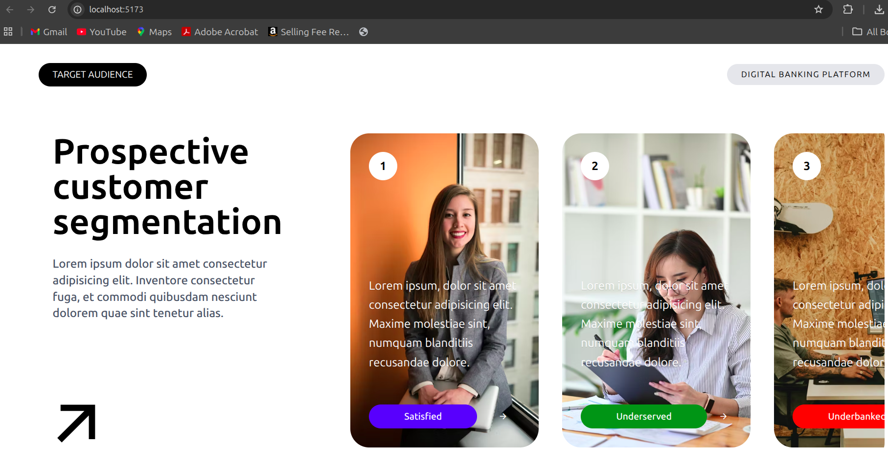

## UI Project

A modern and responsive React + Tailwind CSS UI project built using Vite.  
This project showcases a clean customer segmentation interface with reusable components, responsive layouts, interactive cards, and modern UI styling.

---

# Preview



---

# Live UI Overview

This UI contains:

- Customer segmentation cards
- Responsive card layouts
- Interactive arrow button
- Clean minimal interface

---

# Tech Stack

| Technology | Usage |
|---|---|
| React JS | Frontend Library |
| Vite | Development Environment |
| Tailwind CSS | Styling |
| Remix Icons | Icons |
| JavaScript | Functionality |

---

# Features

- Modern responsive design
- Reusable React components
- Tailwind utility-first styling
- Interactive UI cards
- Responsive flex layouts
- Clean folder structure
- Fast Vite development setup
- Remix Icons integration
- Minimal & elegant design

---

# Project Structure

```bash
ui-project/
│
├── src/
│   ├── assets/
│   │   └── UI_project.png
│   │
│   ├── components/
│   │   ├── Section1/
│   │   │   ├── Arrow.jsx
│   │   │   ├── HeroText.jsx
│   │   │   ├── LeftContent.jsx
│   │   │   ├── Navbar.jsx
│   │   │   ├── Page1Content.jsx
│   │   │   ├── RightCard.jsx
│   │   │   ├── RightCardContent.jsx
│   │   │   ├── RightContent.jsx
│   │   │   └── Section1.jsx
│   │   │
│   │   └── Section2/
│   │       └── Section2.jsx
│   │ 
│   ├── App.jsx
│   ├── index.css
│   └── main.jsx
│
├── .gitignore
├── eslint.config.js
├── index.html
├── package-lock.json
├── package.json
├── vite.config.js
└── README.md
```

---

# Installation Guide

## Step 1: Clone Repository

```bash
git clone `https://github.com/codewithmunmun/react-basics.git`
```

---

## Step 2: Move into Project Folder

```bash
cd ui-project
```

---

## Step 3: Install Dependencies

```bash
npm install
```

---

# Tailwind CSS Setup

After creating the React project using Vite:

---

## Step 1: Install Tailwind CSS

Install Tailwind CSS and Vite plugin.

```bash
npm install tailwindcss @tailwindcss/vite
```

---

## Step 2: Configure Vite Plugin

Inside `vite.config.js`

```js
import { defineConfig } from 'vite'
import react from '@vitejs/plugin-react'
import tailwindcss from '@tailwindcss/vite'

export default defineConfig({
  plugins: [
    react(),
    tailwindcss(),
  ],
})
```

---

## Step 3: Import Tailwind CSS

Inside `src/index.css`

```css
@import "tailwindcss";
```

---

# Remix Icon Setup

This project uses Remix Icons for arrow and UI icons.

---

## Install Remix Icons

```bash
npm install remixicon --save
```

---

## Import Remix Icon CSS

Inside `main.jsx`

```js
import 'remixicon/fonts/remixicon.css'
```

---

# Run Development Server

```bash
npm run dev
```

---

# Important Components

| Component | Description |
|---|---|
| Arrow.jsx | Arrow icon component |
| HeroText.jsx | Main heading section |
| LeftContent.jsx | Left-side descriptive content |
| Navbar.jsx | Top navigation bar |
| Page1Content.jsx | Main section layout |
| RightCard.jsx | Customer segmentation card |
| RightCardContent.jsx | Card text and badge section |
| RightContent.jsx | Right-side card container |
| Section1.jsx | Main first section wrapper |

---

# UI Design Highlights

- Large typography for hero text
- Rounded card layouts
- Modern customer segmentation design
- Balanced spacing and padding
- Clean visual hierarchy
- Responsive card alignment
- Minimalistic UI aesthetics

---

# Example Tailwind Classes Used

| Tailwind Class | Purpose |
|---|---|
| flex | Flexbox layout |
| items-center | Align items vertically |
| justify-between | Space between elements |
| rounded-full | Full rounded corners |
| px-5 | Horizontal padding |
| py-3 | Vertical padding |
| text-9xl | Large text size |
| bg-black | Black background |
| text-white | White text |
| gap-* | Space between elements |

---

# Learning Outcomes

By building this project, you can learn:

- React component structure
- Tailwind CSS styling
- Responsive UI design
- Reusable component architecture
- Vite project setup
- Icon library integration
- Modern frontend folder structure

---

# Author

## Munmun Kumari

Frontend Developer & React Learner

---

# License

This project is open-source and available for learning and personal use.

---

# Support

If you like this project:

- Give it a star on GitHub
- Fork the repository
- Share with others

---

# Thank You

Thanks for checking out this project.
Happy Coding 🚀