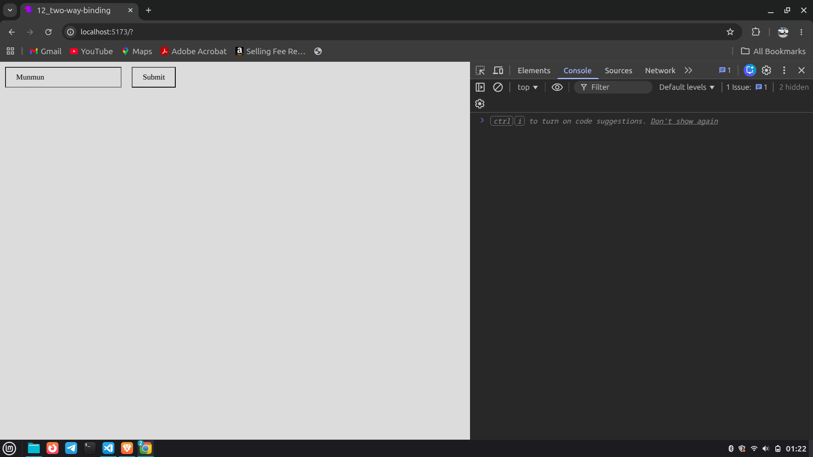
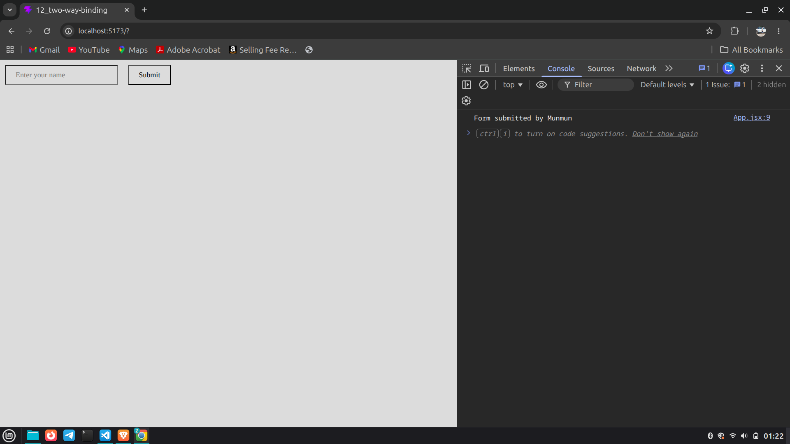

# React Form Handling with Two-Way Binding

A simple React project demonstrating:

- Form Handling
- `onSubmit`
- `preventDefault()`
- Two-Way Binding using `useState`

---

# 🧠 Concept

In React, we do not directly update the website (DOM).

Instead:

```text
User → React State → UI Update
```

React controls the UI using state.

---

# 🔄 Two-Way Binding

Two-way binding means:

```text
Input changes → State updates
State changes → UI updates
```

The input field and state stay synchronized.

---

# 📷 Screenshots

## Before Submission



---

## After Submission



---

# 🚀 Technologies Used

- React
- JavaScript
- JSX
- Vite