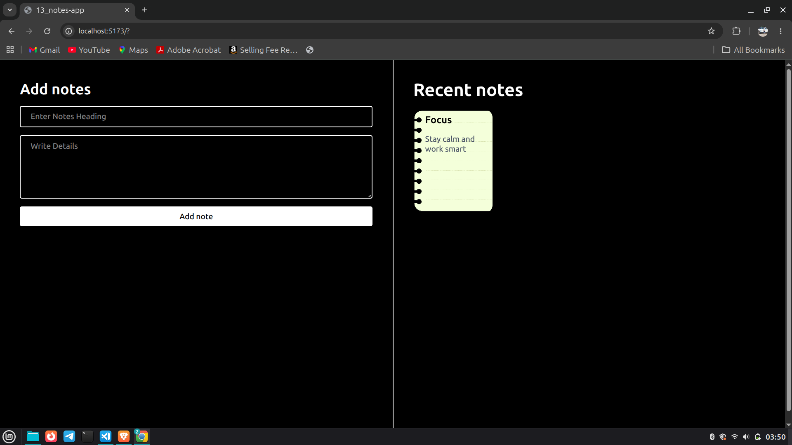
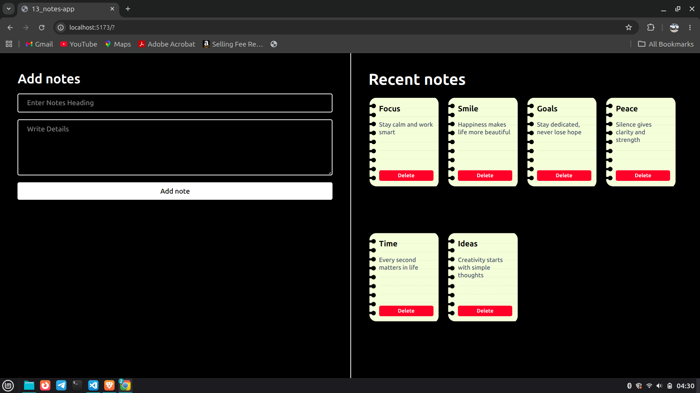
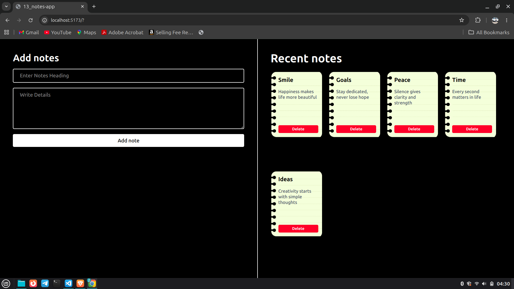

# Notes App

A simple and responsive Notes App built using **React**, **Vite**, and **Tailwind CSS**.  
Users can add notes and delete them instantly with a clean sticky-notes style UI.

---

## Features

- Add notes with title and details
- Delete notes dynamically
- Responsive layout using Tailwind CSS
- React state management with `useState`
- Sticky note card design

---

## Tech Stack

- React
- Vite
- Tailwind CSS
- JavaScript

---

## Installation

Clone the project and install dependencies for React and Tailwind CSS

Start the development server:

```bash
npm run dev
```

--- 

## React Concepts Used

- Functional Components
- useState Hook
- Event Handling
- Controlled Inputs
- Array Mapping
- State Immutability

---

## Project Screenshot

# Adding One Note


---

# After Adding Multiple Notes


---

# Note Deleted


---

## Author

Munmun Kumari