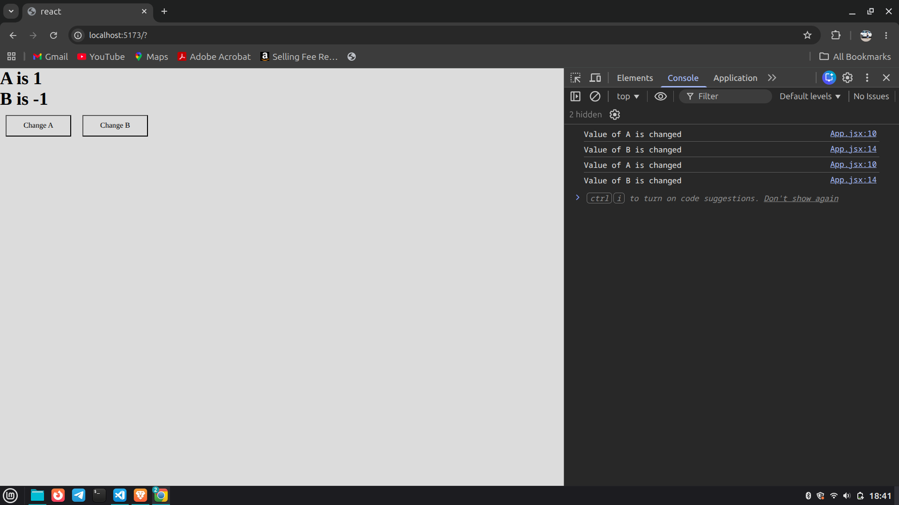

# React useEffect Hook Demo

This project demonstrates how the `useEffect()` Hook works in React with multiple state variables.

The project shows:
- How React state changes
- How component re-rendering works
- How `useEffect()` runs based on dependency arrays
- How separate effects can listen to separate states

---

# Concepts Covered

- React Functional Components
- `useState()` Hook
- `useEffect()` Hook
- Component Re-rendering
- Dependency Array
- Event Handling

---

# Project Code Explanation

The project contains:

## State Variables

```js
const [a, setA] = useState(0)
const [b, setB] = useState(0)
```

- `a` stores first state value
- `b` stores second state value

---

## Functions

```js
function aChanging(){
  console.log('Value of A is changed');
}

function bChanging(){
  console.log('Value of B is changed');
}
```

These functions print messages in the console whenever their related state changes.

---

## useEffect for A

```js
useEffect(function(){
  aChanging()
}, [a])
```

This effect runs:
- after first render
- whenever `a` changes

---

## useEffect for B

```js
useEffect(function(){
  bChanging()
}, [b])
```

This effect runs:
- after first render
- whenever `b` changes

---

# Working Flow

## Initial Render

When the component loads:

```txt
A is 0
B is 0
```

Both `useEffect()` Hooks run once because the component rendered for the first time.

Console Output:

```txt
Value of A is changed
Value of B is changed
```

---

# When "Change A" Button is Clicked

```js
setA(a + 1)
```

Flow:

```txt
A state changes
↓
Component re-renders
↓
[a] dependency changes
↓
First useEffect runs
```

Console:

```txt
Value of A is changed
```

The second effect does NOT run because `b` did not change.

---

# When "Change B" Button is Clicked

```js
setB(b - 1)
```

Flow:

```txt
B state changes
↓
Component re-renders
↓
[b] dependency changes
↓
Second useEffect runs
```

Console:

```txt
Value of B is changed
```

The first effect does NOT run because `a` did not change.

---

# Important useEffect Rules

## 1. Dependency Array

```js
useEffect(() => {}, [dependency])
```

The effect runs whenever the dependency changes.

---

## 2. Empty Dependency Array

```js
useEffect(() => {}, [])
```

Runs only once after first render.

---

## 3. No Dependency Array

```js
useEffect(() => {})
```

Runs after every render.

---

# React Internal Flow

```txt
State changes
↓
React re-renders component
↓
React compares dependencies
↓
Changed dependency effect runs
```

---

# Output Example

## Clicking "Change A"

```txt
A is 1
Value of A is changed
```

---

## Clicking "Change B"

```txt
B is -1
Value of B is changed
```

---

## Screenshots

# Before Changing Screenshot


# After Changing the value of A Screenshot


# Thenafter Changing the value of B Screenshot


---

# Learning Outcome

After completing this project, you will understand:

- How React tracks state changes
- How re-rendering works
- How `useEffect()` behaves
- How dependency arrays control effects
- How multiple effects work independently

---

# Technologies Used

- React
- JavaScript
- JSX

---

# Author
Munmun Kumari

Developed for learning React Hooks and component lifecycle behavior.