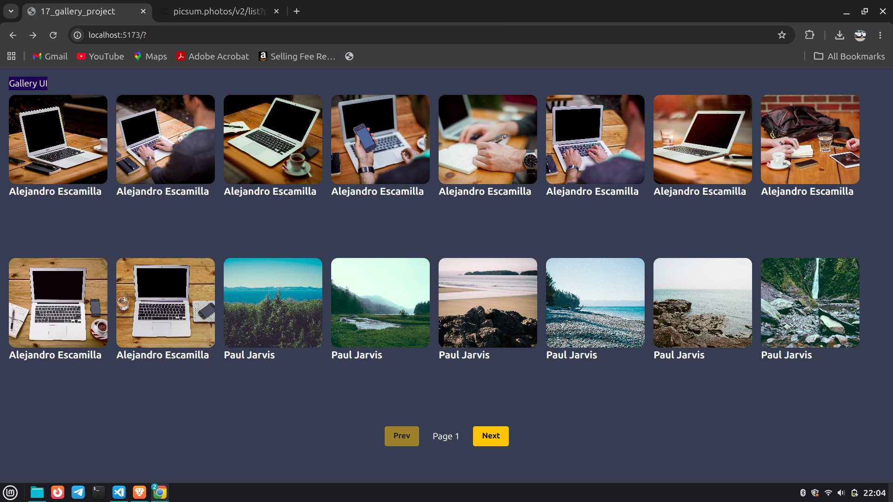
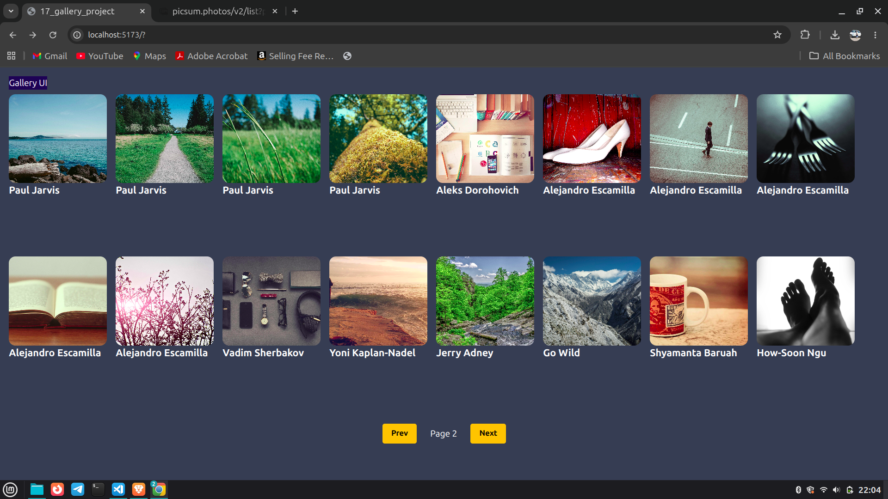

# React Gallery Project

A simple and responsive image gallery application built using React, Axios, and Tailwind CSS.  
This project fetches random images from the Picsum API and displays them in a clean card layout with pagination support.

---

# Features

- Fetch images from Picsum API
- Pagination support (Next / Prev)
- Loading state while fetching data
- Responsive gallery layout
- Open original image in new tab
- Built using React functional components and hooks

---

# Tech Stack

- React
- Axios
- Tailwind CSS
- Picsum API

---

# Folder Structure

```bash
src
│
├── components
│   └── Card.jsx
│
├── App.jsx
└── main.jsx
```

---

# Installation

## 1. Clone the Repository

```bash
git clone https://github.com/codewithmunmun/react-basics.git
```

---

## 2. Navigate to Project Folder

```bash
cd react-app/17_gallery_project
```

---

## 3. Install Dependencies

```bash
npm install
```

---

## 4. Start Development Server

```bash
npm run dev
```

---

# API Used

## Picsum Photos API

```bash
https://picsum.photos/v2/list?page=1&limit=16
```

This API provides random images along with author details.

---

# Concepts Used

- React Functional Components
- useState Hook
- useEffect Hook
- API Calling using Axios
- Conditional Rendering
- Props
- Array Mapping
- Pagination Logic
- Tailwind CSS Styling

---

# Component Explanation

## App.jsx

Responsible for:

- Fetching API data
- Managing state
- Pagination handling
- Rendering gallery cards

### States Used

| State | Purpose |
|---|---|
| userData | Stores API image data |
| index | Stores current page number |

---

## Card.jsx

Responsible for:

- Displaying image
- Displaying author name
- Redirecting to original image link

---

# How Pagination Works

- Clicking **Next** increases page number
- Clicking **Prev** decreases page number
- `useEffect()` runs whenever page index changes
- New images are fetched automatically

---

# 🖥️ Screenshot


### Gallery UI - Page 1


### Gallery UI - Page 1


---

# Future Improvements

- Add search functionality
- Add image modal preview
- Add lazy loading
- Add skeleton loader
- Add infinite scrolling
- Add dark/light mode

---

# Author

Munmun Kumari

---