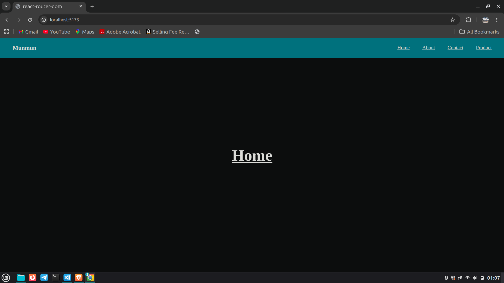
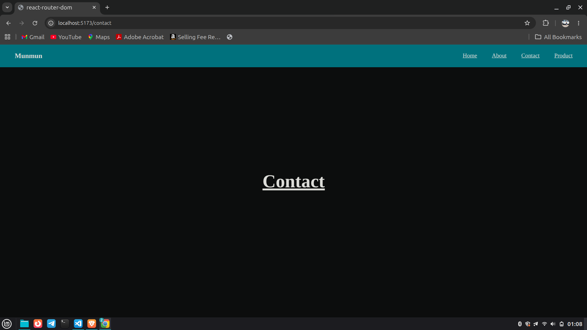
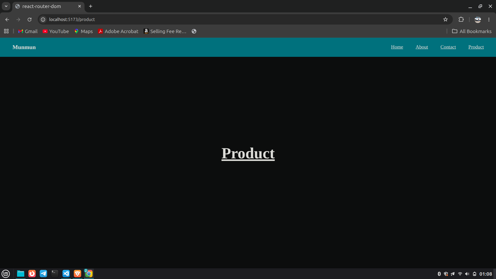

# React Router DOM Project

A simple React project to understand routing using the `react-router-dom` library.  
This project demonstrates navigation between multiple pages without refreshing the browser.

---

# Features

- Routing using `react-router-dom`
- Navigation using `Link`
- Separate pages for:
  - Home
  - About
  - Contact
  - Product
- Reusable Navbar component
- Client-side routing without page reload

---

# Installation

## 1. Create React App

```bash
npm create vite
```

---

## 2. Install Dependencies

```bash
npm i react-router-dom
```

---

## 3. Start Development Server

```bash
npm run dev
```

---

# Project Structure

```bash
src/
│
├── Components/
│   └── Navbar.jsx
│
├── pages/
│   ├── Home.jsx
│   ├── About.jsx
│   ├── Contact.jsx
│   └── Product.jsx
│
├── App.jsx
├── main.jsx
└── index.css
```

---

# Important Concepts Used

## BrowserRouter

`BrowserRouter` enables routing in the React application using the browser history API.

```jsx
<BrowserRouter>
  <App />
</BrowserRouter>
```

---

## Routes

`Routes` is a container that contains all routes of the application.

```jsx
<Routes>
  <Route path='/' element={<Home />} />
</Routes>
```

---

## Route

`Route` renders a component based on the URL path.

```jsx
<Route path='/about' element={<About />} />
```

---

## Link

`Link` is used for navigation between pages without refreshing the browser.

```jsx
<Link to='/contact'>Contact</Link>
```

---

# Routing Pages

## Home Page

```jsx
<Route path='/' element={<Home />} />
```

---

## About Page

```jsx
<Route path='/about' element={<About />} />
```

---

## Contact Page

```jsx
<Route path='/contact' element={<Contact />} />
```

---

## Product Page

```jsx
<Route path='/product' element={<Product />} />
```

---

# Navbar Component

The Navbar contains navigation links for all pages.

```jsx
<Link to='/'>Home</Link>
<Link to='/about'>About</Link>
<Link to='/contact'>Contact</Link>
<Link to='/product'>Product</Link>
```

---

# Screenshots

## Home Page



---

## About Page


---

## Contact Page



---

## Product Page



---

# Output

- Clicking on Navbar links changes the URL
- Components render without page refresh
- Navigation becomes fast and smooth

---

# Technologies Used

- React
- React Router DOM
- CSS
- Vite

---

# Author

Munmun Kumari