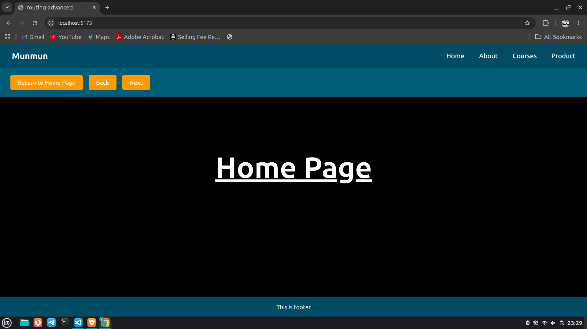

# React Router Advanced

A simple React project demonstrating advanced routing concepts using **React Router DOM**, styled using **Tailwind CSS**, and built with **Vite**.

---

# Features

- Basic Routing
- Dynamic Routing
- Nested Routing
- Route Navigation using `useNavigate()`
- URL Parameters using `useParams()`
- 404 Not Found Page
- Shared Navbar and Footer
- Tailwind CSS Styling

---

# Tech Stack

- React
- Vite
- React Router DOM
- Tailwind CSS

---

# Project Preview



---

# Folder Structure

```bash
src/
│
├── components/
│   ├── Footer.jsx
│   ├── Navbar.jsx
│   └── Navbar2.jsx
│
├── pages/
│   ├── About.jsx
│   ├── CourseDetail.jsx
│   ├── Courses.jsx
│   ├── Home.jsx
│   ├── Kids.jsx
│   ├── Men.jsx
│   ├── NotFound.jsx
│   ├── Product.jsx
│   └── Women.jsx
│
├── App.jsx
├── index.css
└── main.jsx
```

---

# Installation

## Step 1: Create Vite Project

```bash
npm create vite
```

---

## Step 2: Install Dependencies

```bash
npm install
npm install react-router-dom
npm install tailwindcss @tailwindcss/vite
```

---

# Run the Project

```bash
npm run dev
```

---

# Routing Used

## Basic Routing

```jsx
<Route path='/' element={<Home />} />
<Route path='/about' element={<About />} />
<Route path='/courses' element={<Courses />} />
```

---

## Dynamic Routing

```jsx
<Route path='/courses/:courseId' element={<CourseDetail />} />
```

Example URLs:

```bash
/courses/react
/courses/javascript
/courses/nodejs
```

Get URL parameter using:

```jsx
const params = useParams()
console.log(params.courseId)
```

---

## Nested Routing

```jsx
<Route path='/product' element={<Product />}>
  <Route path='men' element={<Men />} />
  <Route path='women' element={<Women />} />
  <Route path='kids' element={<Kids />} />
</Route>
```

Render child routes using:

```jsx
<Outlet />
```

---

## Navigation using useNavigate()

```jsx
const navigate = useNavigate()
```

Examples:

```jsx
navigate('/')
navigate(-1)
navigate(+1)
```

---

# Pages Included

- Home Page
- About Page
- Courses Page
- Course Detail Page
- Product Page
- Men's Collection Page
- Women's Collection Page
- Kid's Collection Page
- 404 Not Found Page

---

# Concepts Covered

- BrowserRouter
- Routes and Route
- Link Component
- Dynamic Routes
- URL Parameters
- Nested Routes
- Outlet
- useNavigate Hook
- useParams Hook
- 404 Handling

---

# Author

## Munmun Kumari