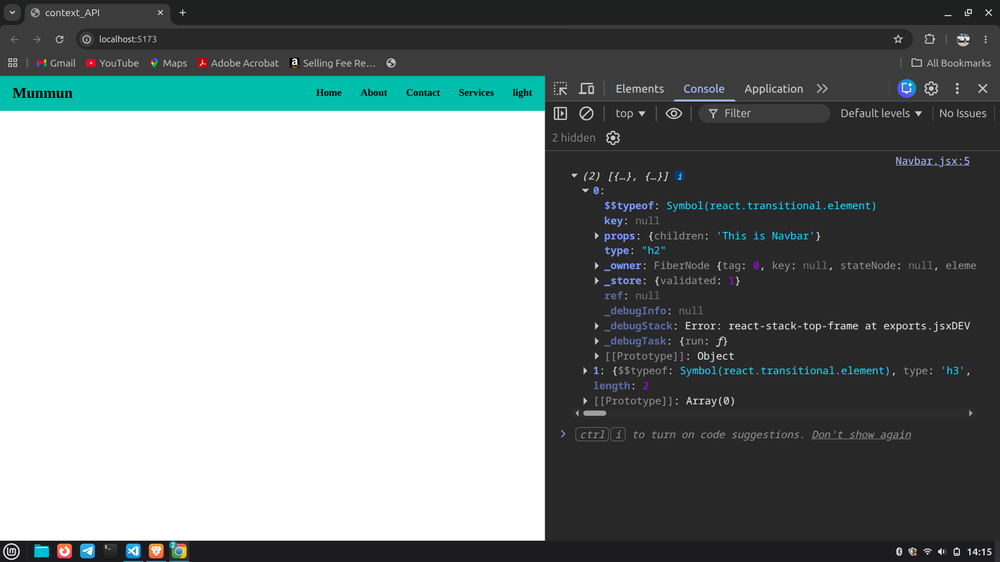

# React Context API - Basic Props and Children Flow

This project demonstrates:

- Passing data from parent to child using props
- Using `props.children`
- Understanding component nesting
- Basic idea behind Context API
- Destructuring concepts in React components

---
# Screenshot



---

# Project Structure

```bash
21_context_API/
│
├── src/
│   ├── assets/
│   │   └── basic_Concept.png
│   │
│   ├── components/
│   │   ├── Navbar.jsx
│   │   └── Nav2.jsx
│   │
│   ├── App.jsx
│   └── index.css
│
├── package.json
└── README.md
```

---

# Concepts Used

## 1. Props

Props are used to pass data from parent component to child component.

Example:

```jsx
<Nav2 theme={props.theme}/>
```

Here, `theme` is passed from `Navbar` to `Nav2`.

---

## 2. props.children

`props.children` represents the content written inside a component tag.

Example:

```jsx
<Navbar theme={theme}>
  <h2>This is Navbar</h2>
  <h3>Hello</h3>
</Navbar>
```

The above elements become children of `Navbar`.

Inside `Navbar.jsx`:

```jsx
console.log(props.children);
```

Output:

```js
[
  <h2>This is Navbar</h2>,
  <h3>Hello</h3>
]
```

Because there are two child elements, React stores them in an array.

---

# App Component

## App.jsx

```jsx
import { useState } from 'react'
import Navbar from './components/Navbar'

const App = () => {

  const [theme, setTheme] = useState('light')

  return (
    <div>
      <Navbar theme={theme}>
        <h2>This is Navbar</h2>
        <h3>Hello</h3>
      </Navbar>
    </div>
  )
}

export default App
```

### Explanation

- `theme` state is created using `useState`
- `theme` is passed to `Navbar`
- Two child elements are passed inside `Navbar`

---

# Navbar Component

## Navbar.jsx

```jsx
import Nav2 from './Nav2'

const Navbar = (props) => {

  console.log(props.children);

  return (
    <div className='nav'>
        <h2>Munmun</h2>
        <Nav2 theme={props.theme}/>
    </div>
  )
}

export default Navbar
```

### Explanation

- `props.children` prints child elements
- `theme` prop is forwarded to `Nav2`

---

# Nav2 Component

## Nav2.jsx

```jsx
const Nav2 = (props) => {
  return (
    <div className='nav2'>
      <h4>Home</h4>
      <h4>About</h4>
      <h4>Contact</h4>
      <h4>Services</h4>
      <h4>{props.theme}</h4>
    </div>
  )
}

export default Nav2
```

### Explanation

- Receives `theme` prop
- Displays current theme value

---

# Styling

## index.css

```css
* {
  margin: 0;
  padding: 0;
  box-sizing: border-box;
  font-family: 'Helvetica Neue';
}

html,
body {
  height: 100%;
  width: 100%;
}

.nav{
  display: flex;
  background-color: lightseagreen;
  justify-content: space-between;
  align-items: center;
  padding: 14px 20px;
}

.nav2{
  display: flex;
  gap: 30px;
}
```

---

# Important Note About Destructuring

Incorrect way:

```jsx
const Navbar = (children, theme) => {
```

React components receive only one argument: `props`.

Correct destructuring:

```jsx
const Navbar = ({ children, theme }) => {
```

Example:

```jsx
const Navbar = ({ children, theme }) => {

  console.log(children);

  return (
    <div className='nav'>
      <h2>Munmun</h2>
      <Nav2 theme={theme}/>
    </div>
  )
}
```

---

# Screenshot

## Basic Concept Diagram

```bash
src/assets/basic_Concept.png
```

Add screenshot in README like this:

```md

```

---

# Output

- Navbar is displayed
- Navigation links are shown
- Current theme (`light`) is displayed
- `props.children` prints child elements in console

---

# Key Learnings

- Parent to child data flow using props
- Understanding `props.children`
- Component nesting
- Prop forwarding
- Basic destructuring in React
- Foundation required before learning Context API

---

# Run Project

## Install Dependencies

```bash
npm install
```

## Start Development Server

```bash
npm run dev
```

---

# Tech Stack

- React
- Vite
- JavaScript
- CSS

# Author

## Munmun Kumari