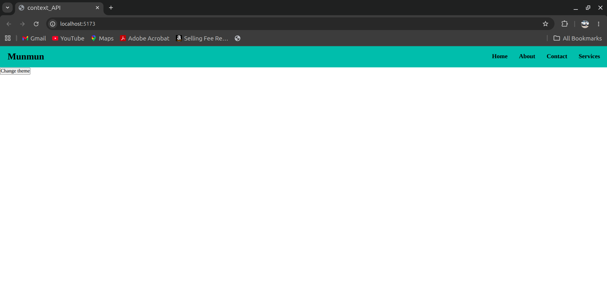
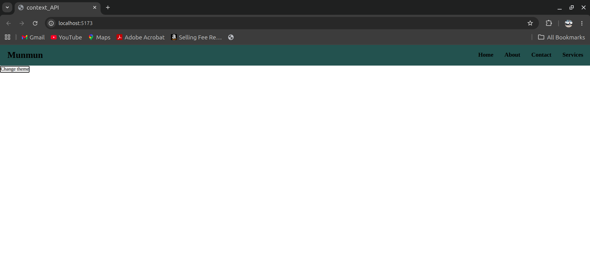

# React Context API - Real Concept

This project demonstrates the real use of the React Context API for global state management.

The application changes the navbar theme using Context API without passing props manually through multiple components.

---

# Project Objective

The main objective of this project is to understand:

- Why Context API is needed
- How to create context
- How to provide global data using Provider
- How to access shared data using useContext
- How to update global state from another component

---

# Concepts Used

- React Context API
- createContext()
- useContext()
- useState()
- Context Provider
- Global State Management
- Dynamic Theme Changing

---

# Screenshot

## Light Theme



## Dark Theme



---

# Project Structure

```bash
22_context_API_real_concept/
│
├── src/
│   ├── components/
│   │   ├── Button.jsx
│   │   ├── Navbar.jsx
│   │   └── Nav2.jsx
│   │
│   ├── context/
│   │   └── ThemeContext.jsx
│   │
│   ├── App.jsx
│   ├── main.jsx
│   └── index.css
│
└── index.html
```

---

# Working Flow

## Step 1: Create Context

Inside `ThemeContext.jsx`

```jsx
export const ThemeDataContext = createContext()
```

A context is created which will store shared theme data.

---

## Step 2: Create Global State

```jsx
const [theme, setTheme] = useState('light')
```

The theme state is created globally.

Default theme is:

```jsx
light
```

---

## Step 3: Provide Context

```jsx
<ThemeDataContext.Provider value={[theme, setTheme]}>
    {props.children}
</ThemeDataContext.Provider>
```

The Provider shares:

- theme
- setTheme

with all child components.

---

## Step 4: Wrap Entire App

Inside `main.jsx`

```jsx
<ThemeContext>
    <App />
</ThemeContext>
```

Now every component inside `App` can access the shared context.

---

## Step 5: Consume Context

Inside `Navbar.jsx`

```jsx
const [theme] = useContext(ThemeDataContext)
```

The Navbar receives the current theme value.

---

## Step 6: Apply Dynamic Class

```jsx
<div className={theme}>
```

If theme is:

```jsx
light
```

then `.light` class is applied.

If theme is:

```jsx
dark
```

then `.dark` class is applied.

---

## Step 7: Update Global State

Inside `Button.jsx`

```jsx
const [theme, setTheme] = useContext(ThemeDataContext)
```

Button accesses the global state and updates it.

```jsx
setTheme('dark')
```

When button is clicked:

- global theme changes
- Navbar automatically re-renders
- dark theme gets applied

---

# Components Explanation

## ThemeContext.jsx

Responsible for:

- creating context
- storing global state
- providing global data

---

## Navbar.jsx

Responsible for:

- consuming theme data
- dynamically changing navbar class

---

## Nav2.jsx

A child navigation component containing menu items.

---

## Button.jsx

Responsible for:

- accessing global state
- updating theme using `setTheme()`

---

# Context API Problem Solved

Without Context API:

```text
App → Navbar → Nav2 → Child → Child
```

Props would need to be passed manually at every level.

This is called:

```text
Prop Drilling
```

Context API solves this by providing direct access to shared data.

---

# Theme Flow

```text
ThemeContext
      ↓
Provider shares theme
      ↓
Navbar reads theme
      ↓
Button updates theme
      ↓
Navbar automatically updates UI
```

---

# CSS Classes

## Light Theme

```css
.light{
  background-color: lightseagreen;
}
```

---

## Dark Theme

```css
.dark{
  background-color: darkslategray;
}
```

---

# Key Learning

## createContext()

Used to create global context.

---

## Provider

Used to provide global data to components.

---

## useContext()

Used to consume shared context data directly.

---

## Global State

State that can be accessed from multiple components.

---

# Advantages of Context API

- Avoids prop drilling
- Cleaner component structure
- Easy state sharing
- Better code readability
- Centralized state management

---

# Output

## Initial State

Navbar uses:

```text
light theme
```

---

## After Button Click

Navbar changes to:

```text
dark theme
```

---

# Run Project

## Install Dependencies

```bash
npm install
```

---

## Start Development Server

```bash
npm run dev
```

---

# Final Conclusion

This project demonstrates a real-world implementation of React Context API where:

- global state is created
- state is shared using Provider
- components access data using useContext
- components update shared state directly
- UI updates automatically without prop drilling

---

# Author

## Munmun Kumari