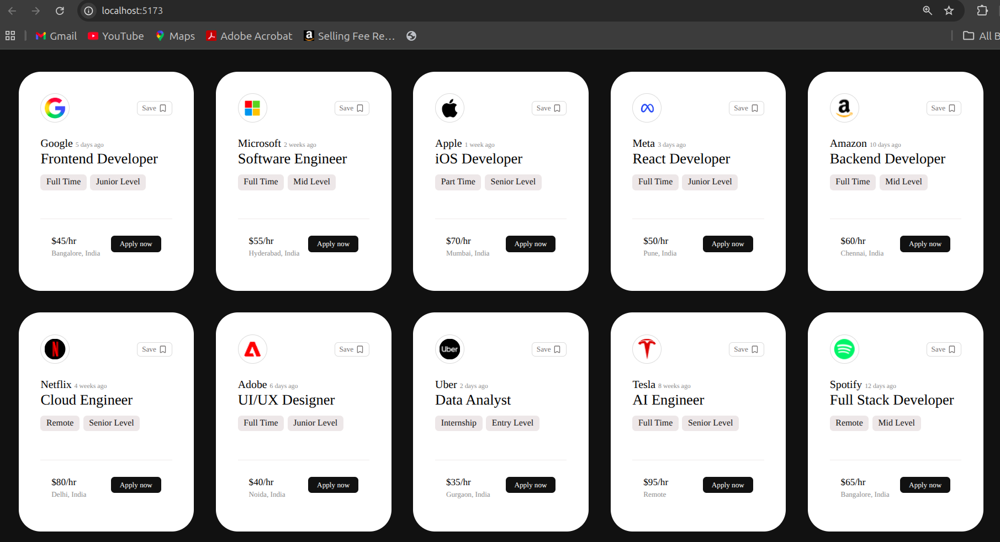

# 💼 Job Cards UI – React Project

A clean and modern **Job Openings Cards UI** built using **React.js** and **CSS**.  
This project displays multiple tech job openings in beautifully designed cards with company logos, job details, salary information, experience tags, and locations.

The UI is inspired by modern job portal dashboards and focuses on reusable React components and dynamic rendering using props and `.map()`.

---

# 📸 Project Screenshot



---

# 🚀 Features

- ⚛️ Built using React + Vite
- 🎨 Clean and modern card design
- 📦 Dynamic rendering using `.map()`
- ♻️ Reusable Card component
- 🏢 Multiple tech company job listings
- 🔖 Save button with icon
- 🏷️ Experience level and job type tags
- 💰 Salary and location section
- 📱 Responsive card layout using Flexbox
- ✨ Lucide React icons integration

---

# 🛠️ Technologies Used

| Technology | Purpose |
|------------|----------|
| React.js | Frontend library |
| Vite | Fast build tool |
| CSS3 | Styling |
| Lucide React | Icons |

---

# 📂 Folder Structure

```bash
4_cards-project/
│
├── public/
│
├── src/
│   ├── assets/
│   │   └── Cards-mini-project.png
│   │
│   ├── components/
│   │   └── Card.jsx
│   │
│   ├── App.jsx
│   ├── index.css
│   └── main.jsx
│
├── index.html
├── package.json
├── package-lock.json
├── vite.config.js
├── eslint.config.js
└── README.md
```

---

# ⚙️ Installation & Setup

## 1️⃣ Clone the Repository

```bash
git clone https://github.com/your-username/4_cards-project.git
```

---

## 2️⃣ Navigate into Project Folder

```bash
cd 4_cards-project
```

---

## 3️⃣ Install Dependencies

```bash
npm install
```

---

## 4️⃣ Run Development Server

```bash
npm run dev
```

---

# 🌐 Open in Browser

After running the development server, open:

```bash
http://localhost:5173
```

---

# 🧠 Concepts Practiced

This project helped in understanding:

- React Components
- JSX
- Props in React
- Dynamic UI Rendering
- Array `.map()` Method
- Reusable Components
- CSS Flexbox
- Component-Based Architecture

---

# 📄 Reusable Card Component

The project uses a reusable `Card` component that receives data through props.

## Example Usage

```jsx
<Card
  brandLogo={elem.brandLogo}
  company={elem.companyName}
  post={elem.post}
  datePosted={elem.datePosted}
  tag1={elem.tag1}
  tag2={elem.tag2}
  pay={elem.pay}
  location={elem.location}
/>
```

---

# 🧩 Card Component Props

| Prop Name | Description |
|-----------|-------------|
| brandLogo | Company logo image |
| company | Company name |
| datePosted | Job posted date |
| post | Job role |
| tag1 | Job type |
| tag2 | Experience level |
| pay | Salary per hour |
| location | Job location |

---


# 🎯 Job Card Information Includes

Each card contains:

- 🏢 Company Logo
- 🏷️ Company Name
- 📅 Date Posted
- 💼 Job Role
- 🕒 Job Type
- 📈 Experience Level
- 💰 Salary
- 📍 Location

---

# 🎨 UI Design Highlights

- Minimal modern interface
- Rounded cards
- Dark background contrast
- Proper spacing and typography
- Flexbox layout
- Consistent UI structure

---

# 🔮 Future Improvements

- 📱 Mobile responsiveness
- 🔍 Search functionality
- 🎯 Job filtering options
- ❤️ Functional save button
- 🌙 Dark/Light theme toggle
- 🌐 Backend/API integration
- 🧾 Pagination support
- ✨ Hover animations

---

# 📦 Dependencies Used

```json
"dependencies": {
  "lucide": "^1.3.0",
  "lucide-react": "^1.3.0",
  "react": "^19.2.6",
  "react-dom": "^19.2.6"
}
```

---

# 🖥️ Run Build Command

To create a production build:

```bash
npm run build
```

---

# 📚 Learning Outcome

By building this project, you learn:

- How React components work
- How to pass props
- How to render lists dynamically
- How reusable UI improves scalability
- How Flexbox layouts are structured
- How modern card interfaces are designed

---

# 👨‍💻 Author

### Munmun Kumari

Frontend Developer & React Learner 🚀

---

# ⭐ Support

If you liked this project:

- Give it a ⭐ on GitHub
- Fork the repository
- Share it with others
- Follow for more React projects

---

# 📜 License

This project is open source and available under the MIT License.

---

# 🙌 Thank You

Thank you for checking out this project ❤️  
Happy Coding 🚀